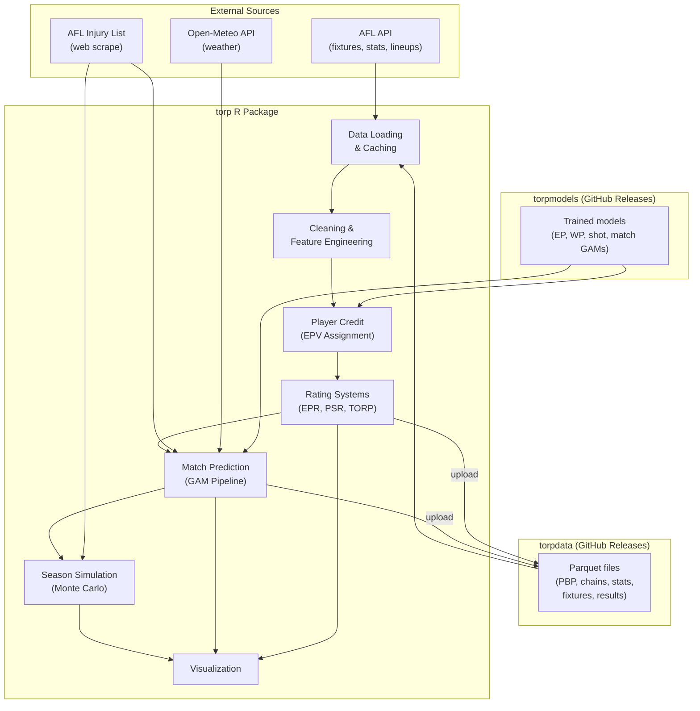
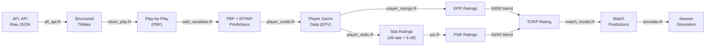
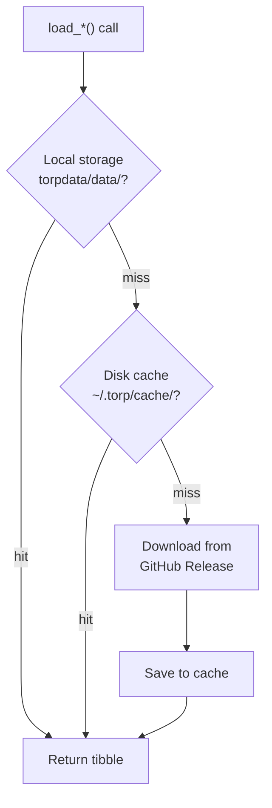
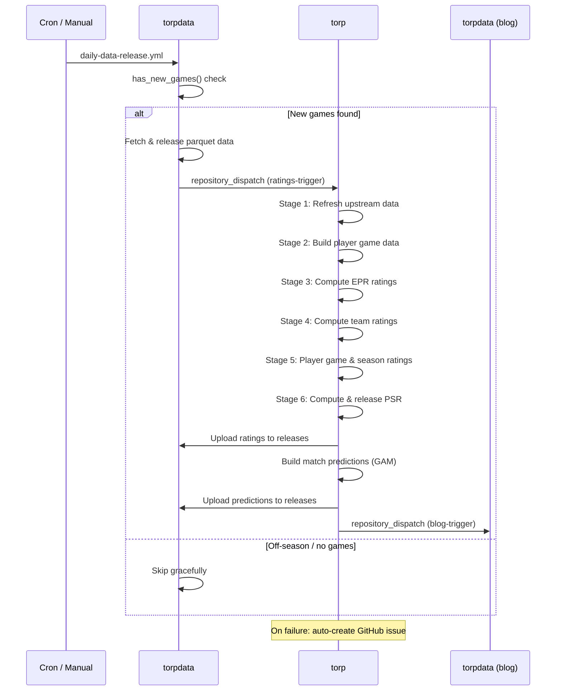

# torp Package Architecture

## Overview

**torp** (Team Offensive Rating Points) is an R package for AFL analytics that transforms raw play-by-play data into player ratings, match predictions, and season simulations. It is the core analytics engine of the torpverse ecosystem:

- **torp** -- Cleans data, adds EP/WP/shot metrics, calculates player ratings, predicts matches, simulates seasons
- **torpdata** -- Stores processed data as parquet files via GitHub Releases (the data bus)
- **torpmodels** -- Stores trained XGBoost and GAM models via GitHub Releases

This document is for human developers and AI agents working with the torp codebase.

## Architecture Diagram



## Data Flow



## Components

### Data Loading & Caching

**Purpose**: Download parquet files from torpdata GitHub Releases and AFL API data, with three-layer caching for performance.

**Key Files**: `R/load_data.R`, `R/load_engines.R`, `R/load_utils.R`, `R/cache.R`, `R/disk_cache.R`, `R/local_data.R`

**Load Functions** (all return tibbles):

| Function | Source | Parameters |
|----------|--------|------------|
| `load_pbp()` | Parquet | `seasons, rounds, use_disk_cache, columns` |
| `load_chains()` | Parquet | `seasons, rounds, use_disk_cache, columns` |
| `load_player_game_data()` | Parquet | `seasons, use_disk_cache, columns` |
| `load_player_stats()` | API | `seasons, use_disk_cache, refresh, columns` |
| `load_fixtures()` | API | `seasons, all, use_disk_cache, columns, use_cache` |
| `load_teams()` | API | `seasons, use_disk_cache, refresh, columns` |
| `load_results()` | Parquet | `seasons, use_disk_cache, columns` |
| `load_player_details()` | API | `seasons, use_disk_cache, refresh, columns` |
| `load_torp_ratings()` | Parquet | `columns` |
| `load_team_ratings()` | Parquet | `columns` |
| `load_player_season_ratings()` | Parquet | `seasons, use_disk_cache, columns` |
| `load_xg()` | Parquet | `seasons, rounds, use_disk_cache, columns` |
| `load_ep_wp_charts()` | Parquet | `seasons, rounds, use_disk_cache, columns` |

**Cache Resolution Order**:



| Layer | Location | Scope | TTL |
|-------|----------|-------|-----|
| Local storage | `torpdata/data/` | Workspace | Never expires (historical); 1 day (current season) |
| Disk cache | `~/.torp/cache/` | Machine | 7 days (URL-hashed parquet files) |
| In-memory cache | `.torp_cache` env | Session | 1 hour (API-backed functions) |

**Interactions**:
- Downloads via `parquet_from_urls_parallel()` using `curl::multi_download()`
- All columns normalized to snake_case via `column_schema.R` normalizers on load

---

### Data Cleaning & Feature Engineering

**Purpose**: Transform raw chains/API data into standardized play-by-play (PBP), normalize column names, and inject EP/WP model predictions.

**Key Files**: `R/clean_pbp.R`, `R/column_schema.R`, `R/add_variables.R`, `R/clean_features.R`

**PBP Cleaning** (`clean_pbp()` / `clean_pbp_dt()`):
- Fixes coordinate errors via `fix_chain_coordinates_dt()` (see Coordinate System below)
- Adds game clock: `period_seconds`, `est_qtr_elapsed`, `est_match_elapsed`
- Strips contest-only descriptions -- keeps only the 27 ball-movement plays in `EPV_RELEVANT_DESCRIPTIONS`
- Normalizes team names via `AFL_TEAM_ALIASES` and `torp_replace_teams()`
- Implemented as data.table operations that modify by reference for performance

**Coordinate System**:

The AFL API delivers `x,y` in a **possession-team-relative** frame: positive x = towards that team's attacking goal, ranging ±80m (half venue_length). `y` ranges ±70m (half venue_width). Since teams face opposite directions, the same physical spot has opposite signs for home vs away.

`fix_chain_coordinates_dt()` converts to **pitch-relative** (`x_pitch`, `y_pitch`) -- a fixed home-team frame where the same physical location always has the same coordinates regardless of possession. This makes consecutive rows spatially comparable for EP/WP modeling.

The AFL API frequently delivers coordinates in the **wrong team's frame** at possession changes (~12% of non-throw-in rows), producing sign-flipped x,y values. The fix pipeline in `clean_pbp.R` corrects this in 8 steps:

| Step | Fix | What it catches |
|------|-----|-----------------|
| A | Convert to pitch-relative (`as.double`) | Frame alignment + avoids integer truncation |
| B | Throw-in fix (2 passes) | Centre Bounce, OOB, Ball Up rows → use next row's position |
| C | Iterative sign-flip (`COORD_FLIP_TOLERANCE`) | Single and cascading wrong-frame rows. Flips when jump >100m but negating puts within 70m of predecessor |
| D | Both-neighbor sign-flip (60m tolerance) | Longer-distance sign-flips confirmed by both neighbors |
| E | Neighbor interpolation | Remaining outliers far from both neighbors |
| F | Paired sign-flip | Two consecutive wrong rows (e.g. Spoil + Kickin) |
| G | Convert back to team-relative | Restores `x,y` to possession-team frame |
| H | Recalculate `goal_x` | `venue_length / 2 - x` |

Constants in `R/constants_data.R`: `COORD_JUMP_THRESHOLD` (100m) gates all sign-flip checks. `COORD_FLIP_TOLERANCE` (70m) is the max flipped distance to classify as a sign error -- set to cover the longest realistic kick distances. Together they eliminate ~99.7% of >100m pitch-relative jumps.

**Column Schema** (`column_schema.R`):
- 11 COL_MAP constants (named character vectors) for each data type: `PLAYER_STATS_COL_MAP`, `PBP_COL_MAP`, `FIXTURE_COL_MAP`, `TEAMS_COL_MAP`, `CHAINS_COL_MAP`, `PLAYER_GAME_COL_MAP`, `TORP_RATINGS_COL_MAP`, `PLAYER_GAME_RATINGS_COL_MAP`, `PLAYER_DETAILS_COL_MAP`, `PREDICTIONS_COL_MAP`, `XG_COL_MAP`
- Each has a `.normalise_*_columns()` function that applies the map plus bulk snake_case conversion

**Feature Engineering** (`add_variables.R`):
- `add_epv_vars(df, reference_date)` -- Injects EP model predictions. The EP model predicts 4 probabilities (`opp_goal`, `opp_behind`, `goal`, `behind`) which combine into `exp_pts = 6*goal - 6*opp_goal + opp_behind - behind`. Also computes `delta_epv`, `xpoints_diff`, `weight_gm` (365-day half-life decay).
- `add_wp_vars(df)` -- Injects WP model predictions. Adds `wp` (home win probability) and `wpa` (win probability added per play).

**Model Training Data** (`clean_features.R`):
- `clean_model_data_epv_dt()` -- Prepares data.table-optimized training data for the EP XGBoost model with lag/lead context and mirrored defensive coordinates

---

### Player Credit (EPV Assignment)

**Purpose**: Allocate expected points value (EPV) credit to individual players for each match, forming the foundation for player ratings.

**Key Files**: `R/player_credit.R`, `R/constants_ratings.R`

**Entry Point**: `create_player_game_data(pbp_data, player_stats, teams, decay, epv_params)`

**Four-Component Credit System**:

| Component | Key Weights (from `default_epv_params()`) | What It Measures |
|-----------|-------------------------------------------|------------------|
| Disposal EPV | Goals (0.44), Behinds (1.08), Inside 50s (0.25), Score involvements (0.31), Clangers (-0.005), Turnovers (-0.11) | Value created by kicking/handballing |
| Reception EPV | Marks inside 50 (0.40), Ground ball gets (0.22), Contested marks (0.07), Frees for (0.18) | Value created by receiving the ball |
| Spoil EPV | Tackles (0.31), One-percenters (0.16), Spoils (0.083), Intercepts (0.065), Rebound 50s (-0.19) | Defensive value |
| Hitout EPV | Hitouts to advantage (0.17), Clearances (0.11), Hitouts (0.052), Ruck contests (0.023) | Ruck value |

**Bayesian Shrinkage**: Each component uses the formula:
```
EPR_component = (loading * sum_val + prior_games * prior_rate) / (wt_games + prior_games)
```
Default priors: `prior_games = 3.0` for all components; `prior_rate` = -0.4 (recv), -0.3 (disp), 0 (spoil/hitout).

**TOG Adjustment**: Output is adjusted to per-80-minute rates using position-based average TOG from `POSITION_AVG_TOG` (e.g., FB = 0.91, INT = 0.73, SUB = 0.33).

---

### Player Rating Systems

**Purpose**: Compute player-level ratings that predict future performance, using multiple complementary approaches blended into TORP.

**Key Files**: `R/player_ratings.R`, `R/player_skills.R`, `R/skill_config.R`, `R/psr.R`

#### EPR (Expected Points Rating)

**Function**: `calculate_epr(season_val, round_val, decay_*, prior_*, skills, ...)`

**Algorithm**:
1. Load all player game data up to the reference date
2. Apply exponential decay weighting per component (different half-lives reflect how quickly each skill changes):

| Component | Decay (days) | Approx Half-Life |
|-----------|-------------|-------------------|
| Reception | 282 | ~392 days |
| Hitout | 456 | ~633 days |
| Disposal | 573 | ~796 days |
| Spoil | 577 | ~802 days |

3. Aggregate by player with weighted sums and weighted game counts
4. Apply Bayesian shrinkage per component
5. (Optional) TOG-weighted centering using conditional TOG and squad selection ratings from stat ratings

**Output**: `epr = recv_epr + disp_epr + spoil_epr + hitout_epr`

#### Stat Ratings (Bayesian Conjugate Models)

**Function**: `estimate_player_stat_ratings(stat_rating_data, ref_date, params, stat_defs, compute_ci)`

**Coverage**: 48 rate stats + 6 efficiency stats, defined in `stat_rating_definitions()`.

| Stat Type | Model | Prior | Decay |
|-----------|-------|-------|-------|
| Rate stats (goals, disposals, marks, tackles, ...) | Gamma-Poisson | Position mean, strength = `prior_games` (default 5) | lambda = 0.0019/day (~365-day half-life) |
| Efficiency stats (disposal efficiency, mark %, ...) | Beta-Binomial | Position mean, strength = `prior_attempts` (default 30) | lambda = 0.0013/day (~533-day half-life) |

**Output**: Per player, per stat: `{stat}_rating`, `{stat}_rating_lower`, `{stat}_rating_upper` (80% credible interval).

#### PSR (Player Skill Rating)

**Function**: `calculate_psr(skills, coef_df, center)` / `calculate_psr_components(skills, coef_df, osr_coef_df, dsr_coef_df, center)`

**Algorithm**: Applies pre-trained glmnet coefficients to stat ratings. If coefficients include an `sd` column, stat ratings are standardized first.

**Decomposition**:
- **OSR** (Offensive Skill Rating): Offensive stat coefficients (disposals, marks, goals, ...)
- **DSR** (Defensive Skill Rating): Defensive stat coefficients (tackles, intercepts, ...)
- `PSR = OSR + DSR` (centered to league mean)

#### TORP (Blended Rating)

**Formula**: `TORP = 0.5 * EPR + 0.5 * PSR` (weight configurable via `TORP_EPR_WEIGHT`)

**Per-Game Values**:
- `calculate_psv()` -- Per-game stat value (PSR analogue from single-match stats)
- Player game ratings combine EPV (EPR component) and PSV (PSR component)

---

### Match Prediction Pipeline

**Purpose**: Predict match outcomes (expected total points, margin, win probability) using team-level TORP ratings, positional matchups, venue, and weather.

**Key Files**: `R/match_model.R`, `R/match_data_prep.R`, `R/match_train.R`

**Orchestration**: `run_predictions_pipeline(week, weeks, season)` -- auto-detects the next week if NULL; accepts `weeks = "all"` for backfill.

**Feature Engineering** (`build_team_mdl_df()`):
1. `.build_fixtures_df()` -- Temporal features (year, month, day, hour, week progress)
2. `.build_team_ratings_df()` -- Aggregates top 21 players by TORP per team; injury discount = 0.95; position phase groups (def/mid/fwd)
3. `.build_match_features()` -- Haversine venue distance, venue familiarity
4. `.load_match_weather()` -- Temperature, wind, humidity, precipitation from Open-Meteo

**Feature Categories**:
- TORP differences: `epr_diff`, `recv_diff`, `disp_diff`, `spoil_diff`, `hitout_diff`
- Position matchups: `hoff_adef`, `hmid_amid`, `hdef_afwd` (phase-level diffs)
- Score features: `score_diff`, `shot_diff`, `xscore_diff`
- Weather: `temp_avg`, `wind_avg`, `humidity_avg`, `precipitation_total`
- Recency weight: `weightz` (1000-day half-life)

**Sequential GAM Pipeline** (via `mgcv::bam()`):
1. **xPoints model** -- Predicts expected total points
2. **Score Diff model** -- Predicts margin
3. **Win Prob model** -- Predicts win probability

**Output**: One row per match with `pred_xtotal`, `pred_xmargin`, `pred_margin`, `pred_win`, `bits` (log-loss).

---

### Season Simulation

**Purpose**: Monte Carlo simulation of remaining AFL season games, producing ladder probabilities and premiership odds.

**Key Files**: `R/simulate.R`, `R/ladder.R`, `R/finals_sim.R`, `R/season_sim.R`, `R/injuries_scrape.R`, `R/injuries_match.R`, `R/injuries_schedule.R`

**Entry Point**: `simulate_afl_season(season, n_sims, team_ratings, fixtures, predictions, injuries, seed, verbose, keep_games, n_cores)`

**Simulation Mechanics** (per round, per simulation):
1. Add back TORP from returning injured players (via `build_injury_schedule()`)
2. For each unplayed game: `home_margin = home_epr - away_epr + home_advantage + noise`
   - Home advantage: `SIM_HOME_ADVANTAGE = 6` points
   - Noise: N(0, `SIM_NOISE_SD = 26`) + N(0, `SIM_INJURY_SD = 3`)
   - Mean reversion: 1% gap to league mean closes each round (`SIM_MEAN_REVERSION = 0.01`)
3. Update team ratings after each round

**Ladder Calculation** (`calculate_ladder()`):
- AFL points: Win = 4, Draw = 2, Loss = 0
- Tiebreak order: ladder points > percentage (for/against) > points for

**Finals Bracket** (`simulate_finals()`):
- 8-team AFL finals system with home advantage modifiers
- Grand Final venue familiarity adjustment

**Injury Pipeline**:
- `scrape_injuries()` -- Scrapes afl.com.au injury list
- `parse_return_round()` -- Parses "Round N", "N weeks", "TBC" to numeric round
- `build_injury_schedule()` -- Computes per-team TORP boosts when players return

---

### Daily CI/CD Pipeline

**Purpose**: Automated daily pipeline that detects new AFL games, rebuilds ratings, generates predictions, and publishes data.

**Key Files**: `data-raw/03-ratings/run_ratings_pipeline.R`, `.github/workflows/daily-ratings-predictions.yml`



**Ratings Pipeline Stages** (`run_ratings_pipeline.R`):

| Stage | Name | Description |
|-------|------|-------------|
| 1 | Refresh Upstream Data | Re-fetch `player_stats` + `teams` from AFL API (skippable via `REFRESH_UPSTREAM`) |
| 2 | Build Player Game Data | `create_player_game_data()` from PBP + stats + teams; release to `player_game-data` |
| 3 | Compute EPR Ratings | `calculate_epr_stats_batch()` per season/round; blend with PSR for TORP |
| 4 | Compute Team Ratings | TOG-weighted aggregation of player ratings to team level |
| 5 | Player Game & Season Ratings | Per-game EPV + PSV; season aggregates |
| 6 | Compute & Release PSR | `calculate_psr()` using precomputed glmnet coefficients |

**Configuration Variables**:
- `SEASONS` -- NULL (current only), numeric vector (specific), or TRUE (all 2021+)
- `REFRESH_UPSTREAM` -- Re-fetch from AFL API
- `REBUILD_PLAYER_GAME` -- Rebuild player game tables from PBP
- `REBUILD_ALL_RATINGS` -- Full rebuild vs incremental upsert

**Safety Mechanisms**:
- `has_new_games()` check prevents unnecessary builds
- Off-season graceful skip
- Auto-creates GitHub issue on failure with troubleshooting steps
- Cross-repo dispatch requires `WORKFLOW_PAT` secret

---

### Supporting Components

#### AFL API (`R/afl_api.R`)
Functions: `get_afl_fixtures()`, `get_afl_results()`, `get_afl_ladder()`, `get_afl_lineups()`, `get_afl_player_stats()`, `get_afl_player_details()`. Uses `httr2` with auth token caching and parallel `curl`-based JSON batch fetching.

#### Expected Goals (`R/xg.R`)
Functions: `calculate_match_xgs()`, `get_xg()`. Applies the shot outcome GAM model (`shot_ocat_mdl`) to shot attempts at field position (x, y), producing match-level and shot-level xG.

#### Contests (`R/contests.R`)
Functions: `extract_contests()`, `head_to_head()`. Matches x,y coordinates on consecutive PBP rows from opposing teams to detect aerial and ground ball contests.

#### Team & Player Name Standardization
Functions: `torp_replace_teams()`, `torp_team_abbr()`, `torp_team_full()`, `torp_replace_venues()`. All team names mapped to canonical full names via `AFL_TEAM_ALIASES`; abbreviations live only in `_abbr` columns.

#### Visualization (7 files)
`plot_game.R` (EP/WP flow charts), `plot_player.R` (rating profiles), `plot_shots.R` (shot maps), `plot_simulation.R` (season sim results), `plot_comparison.R` (player/team comparisons), `plot_team.R` (team-level plots), `plot_utils.R` (shared utilities).

#### Opponent Adjustment

**Purpose**: Adjust player ratings and per-game stats for opponent defensive quality. Players who perform well against strong defences get boosted; those who pad stats against weak teams get deflated.

**Key Files**: `R/opponent_adjustment.R`, `R/epv_opponent_adjustment.R`

**Two adjustment systems**:

| System | Function | Input | Output | Method |
|--------|----------|-------|--------|--------|
| Stat rating | `adjust_stat_ratings_for_opponents()` | Bayesian stat ratings | `{stat}_adj_rating` columns | Multiplicative factor from opponent concession rates |
| Per-game stats | `adjust_stats_for_opponents()` | Raw per-game stats | `{stat}_oadj` columns | Multiplicative factor per player-game |
| EPV | `adjust_epv_for_opponents()` | Player game data with `epv_adj` | `{component}_oadj` columns | Additive adjustment from rolling team defensive profiles |

**EPV adjustment pipeline** (`epv_opponent_adjustment.R`):
1. `.compute_rolling_epv_profiles()` — For each team at each match date, computes decay-weighted average total EPV conceded, shrunk toward league mean via pseudo-games
2. `adjust_epv_for_opponents()` — Applies additive correction: `{component}_oadj = {component}_adj + opponent_adjustment * tog_share`

**Stat adjustment pipeline** (`opponent_adjustment.R`):
1. Computes per-team decay-weighted concession rates for each rate stat (efficiency stats excluded — they're player-intrinsic)
2. Adjustment factor = opponent's concession rate / league average, capped by `OPP_ADJ_FACTOR_CAP`
3. `{stat}_oadj = raw_stat * adjustment_factor`

---

#### Match Simulation

**Purpose**: Monte Carlo simulation of individual match scoring sequences, producing score distributions, quarter breakdowns, and win probability fan charts.

**Key File**: `R/simulate_match.R`

**Entry Point**: `simulate_match_mc(home_team, away_team, season, n_sims, team_ratings, predictions, home_advantage, seed)`

**Simulation Mechanics** (per simulation):
1. Resolve match parameters from predictions or team ratings (expected margin + expected total)
2. Generate scoring events per quarter: individual goals and behinds with timing
3. Accumulate scores and compute running WP via logistic function (scaling factor: `SIM_WP_SCALING_FACTOR`)

**Output**: S3 object `torp_match_sim` with:
- `scores` — data.table of final scores per simulation
- `quarters` — per-quarter breakdown
- `events` — individual scoring events with timing
- `wp_trajectory` — WP fan chart data (mean, p10, p25, median, p75, p90)
- `summary` — win/draw/loss probabilities, score quantiles

**Distinct from `simulate_season()`**: Season simulation (`simulate.R`) simulates margins for remaining games to project ladders. Match simulation simulates individual scoring sequences within a single game for richer in-game analysis.

---

#### Baseline Models (`R/baseline_models.R`)
Reference models for WP evaluation: Naive (always 0.5), Score-Only (logistic on margin), Time-Score (GLM interaction), EP-Based (expected points margin).

#### Model Loading
`load_model_with_fallback()` tries torpmodels package first, falls back to bundled data in `data/*.rda`. Models cached in `.torp_model_cache` environment for session lifetime.

---

## Code References

| Component | File | Key Exports |
|-----------|------|-------------|
| Constants | `R/constants_afl.R`, `R/constants_ratings.R`, `R/constants_sim.R`, `R/constants_match.R`, `R/constants_data.R` | `AFL_TEAMS`/`AFL_TEAM_*` (afl), `EPR_*`/`EPV_*`/`TORP_EPR_WEIGHT`/`POSITION_AVG_TOG` (ratings), `SIM_*`/`MATCH_SIM_*`/`OPP_ADJ_*` (sim), `MATCH_*`/`WP_*`/`FIELD_*` (match), `VALIDATION_*`/`COORD_*`/`CONTEST_*`/`EPV_RELEVANT_DESCRIPTIONS` (data) |
| Load Functions | `R/load_data.R` | `load_pbp()`, `load_chains()`, `load_xg()`, `load_player_stats()`, `load_player_game_data()`, `load_fixtures()`, `load_teams()`, `load_results()`, `load_player_details()`, `load_predictions()`, `load_retrodictions()`, `load_torp_ratings()`, `load_player_game_ratings()`, `load_player_season_ratings()`, `load_team_ratings()`, `load_injury_data()`, `load_ep_wp_charts()`, `load_player_stat_ratings()`, `load_psr()`, `load_weather()` |
| Load Engines | `R/load_engines.R` | `load_from_url()`, `parquet_from_urls_parallel()` |
| Load Utilities | `R/load_utils.R` | `validate_seasons()`, `generate_urls()` |
| Local Data | `R/local_data.R` | `download_torp_data()`, `save_locally()`, `get_local_data_dir()`, `set_local_data_dir()` |
| In-Memory Cache | `R/cache.R` | `clear_data_cache()`, `get_cache_info()` |
| Disk Cache | `R/disk_cache.R` | `is_disk_cached()`, `read_disk_cache()`, `write_disk_cache()`, `get_disk_cache_dir()` |
| PBP Cleaning | `R/clean_pbp.R` | `clean_pbp()`, `clean_pbp_dt()` |
| Column Schema | `R/column_schema.R` | 11 `*_COL_MAP` constants, `.normalise_*_columns()` functions |
| Feature Engineering | `R/add_variables.R` | `add_epv_vars()`, `add_wp_vars()`, `load_model_with_fallback()` |
| Model Data Prep | `R/clean_features.R` | `clean_model_data_epv_dt()` |
| Player Credit | `R/player_credit.R` | `create_player_game_data()`, `default_epv_params()` |
| EPR Ratings | `R/player_ratings.R` | `calculate_epr()`, `calculate_epr_stats()` |
| Stat Ratings | `R/player_skills.R` | `estimate_player_stat_ratings()` |
| Stat Config | `R/skill_config.R` | `stat_rating_definitions()`, `default_stat_rating_params()`, `stat_rating_position_map()` |
| PSR Ratings | `R/psr.R` | `calculate_psr()`, `calculate_psr_components()`, `calculate_psv()` |
| Match Prediction | `R/match_model.R` | `run_predictions_pipeline()`, `build_team_mdl_df()` |
| Match Data Prep | `R/match_data_prep.R` | `.build_fixtures_df()`, `.build_team_ratings_df()`, `.build_match_features()`, `.load_match_weather()` |
| Match Training | `R/match_train.R` | GAM fitting functions |
| WP Utilities | `R/wp_utils.R` | WP input validation, model health checks |
| Baseline Models | `R/baseline_models.R` | Score-only, time-score, EP-based baselines |
| Simulation | `R/simulate.R` | `simulate_season()`, `process_games()`, `process_games_dt()` |
| Match Simulation | `R/simulate_match.R` | `simulate_match_mc()` |
| Ladder | `R/ladder.R` | `calculate_ladder()`, `calculate_final_ladder()` |
| Finals Simulation | `R/finals_sim.R` | `simulate_finals()`, `simulate_match()`, `finals_home_advantage()` |
| Season Simulation | `R/season_sim.R` | `simulate_afl_season()`, `prepare_sim_data()`, `summarise_simulations()` |
| Injury Scraping | `R/injuries_scrape.R` | `scrape_injuries()`, `load_preseason_injuries()` |
| Injury Matching | `R/injuries_match.R` | `get_all_injuries()`, `match_injuries()`, `parse_return_round()` |
| Injury Schedule | `R/injuries_schedule.R` | `build_injury_schedule()`, `save_injury_data()` |
| Injury Validation | `R/injuries_validation.R` | `test_played_rate()`, `tbc_played_rate()`, `injury_return_accuracy()`, `tbc_return_survival()` |
| Expected Goals | `R/xg.R` | `calculate_match_xgs()`, `get_xg()` |
| Contests | `R/contests.R` | `extract_contests()`, `head_to_head()` |
| AFL API | `R/afl_api.R` | `get_afl_fixtures()`, `get_afl_results()`, `get_afl_ladder()`, `get_afl_lineups()`, `get_afl_player_stats()`, `get_afl_player_details()` |
| Team Names | `R/afl_api.R` | `torp_replace_teams()`, `torp_team_abbr()`, `torp_team_full()`, `torp_replace_venues()` |
| Player Profiles | `R/player_profile.R` | `player_profile()` |
| Player Game Ratings | `R/player_game_ratings.R` | `player_game_ratings()`, `player_season_ratings()` |
| Team Profile | `R/team_profile.R` | `team_profile()`, `team_stat_rating_profile()`, `get_team_stat_ratings()` |
| Match Analysis | `R/analyze_match.R` | `get_player_game_ratings()` (live match analysis) |
| Centrality | `R/centrality.R` | `calculate_player_centrality()` |
| Opponent Adj (Stats) | `R/opponent_adjustment.R` | `adjust_stat_ratings_for_opponents()`, `adjust_stats_for_opponents()` |
| Opponent Adj (EPV) | `R/epv_opponent_adjustment.R` | `adjust_epv_for_opponents()` |
| Player Attribution | `R/player_attribution.R` | `calculate_player_attribution()`, `batch_player_attribution()` |
| Stat Rating Data | `R/player_skills_data.R` | Data preparation for stat rating estimation |
| Stat Rating Profiles | `R/player_skills_profile.R` | `player_stat_rating_profile()`, `get_player_stat_ratings()` |
| WP Credit | `R/wp_credit.R` | `create_wp_credit()` (WPA credit allocation) |
| Win Probability | `R/win_probability.R` | `fit_win_probability()` |
| Logging | `R/logging.R` | `setup_torp_logging()`, `monitor_model_drift()` |
| Model Validation | `R/model_validation.R` | `create_grouped_cv_folds()`, `evaluate_model_comprehensive()` |
| Data Validation | `R/data_validation.R` | Input validation utilities |
| Utilities | `R/utils.R` | `torp_clean_names()`, `get_afl_season()`, `get_afl_week()`, `clear_all_cache()` |
| Plot: Game Flow | `R/plot_game.R` | `plot_ep_wp()` |
| Plot: Player | `R/plot_player.R` | `plot_player_rating()`, `plot_stat_rating_profile()` |
| Plot: Shots | `R/plot_shots.R` | `plot_shot_map()` |
| Plot: Simulation | `R/plot_simulation.R` | `plot_simulation()` |
| Plot: Comparison | `R/plot_comparison.R` | `plot_player_comparison()` |
| Plot: Team | `R/plot_team.R` | `plot_team_ratings()` |
| Plot: Utilities | `R/plot_utils.R` | `theme_torp()`, `team_color_scale()`, `team_fill_scale()` |
| Globals | `R/globals.R` | NSE variable declarations for R CMD check |
| Package Init | `R/zzz.R` | `.onLoad()` / `.onAttach()` |
| Data Docs | `R/data.R` | Documentation for bundled datasets |
| Scraper | `R/scraper.R` | Legacy CFS endpoint scraping |

## Column Schema Reference

All data is normalised to canonical `snake_case` at load/fetch time via `R/column_schema.R`. Each data type has a `COL_MAP` constant that maps old/variant column names to canonical names. The `.normalise_*_columns()` wrappers handle multi-step normalisation (prefix stripping, bulk snake_case conversion, derived columns).

### Column Maps by Data Type

| Map | Data Type | Key Renames (old → new) |
|-----|-----------|------------------------|
| `FIXTURE_COL_MAP` | Fixtures/results | `providerId` → `match_id`, `compSeason.year` → `season`, `round.roundNumber` → `round_number`, `home.score.totalScore` → `home_score`, `utcStartTime` → `utc_start_time` |
| `PBP_COL_MAP` | Play-by-play | `home_team_team_name` → `home_team_name`, `home_team_score_total_score` → `home_score`, `home_team_abbreviation` → `home_team_abbr` |
| `CHAINS_COL_MAP` | Chains | `matchId` → `match_id`, `playerId` → `player_id`, `displayOrder` → `display_order`, `periodSeconds` → `period_seconds` |
| `PLAYER_STATS_COL_MAP` | Player stats | `extended_stats_spoils` → `spoils`, `clearances_total_clearances` → `clearances`, `provider_id` → `match_id` (also strips `stats_` prefix from v2 API) |
| `PLAYER_GAME_COL_MAP` | Player game data | `plyr_nm` → `player_name`, `tm` → `team`, `tot_p` → `epv`, `recv_pts` → `recv_epv`, `recv_credits` → `recv_epv` |
| `TEAMS_COL_MAP` | Teams/lineups | `player.playerId` → `player_id`, `teamName` → `team_name`, `player.playerName.givenName` → `given_name` |
| `PLAYER_DETAILS_COL_MAP` | Player details | `providerId` → `player_id`, `firstName` → `first_name`, `heightInCm` → `height_cm`, `dateOfBirth` → `date_of_birth` |
| `TORP_RATINGS_COL_MAP` | TORP ratings | `torp` → `epr`, `torp_recv` → `recv_epr`, `torp_disp` → `disp_epr` |
| `PLAYER_GAME_RATINGS_COL_MAP` | Game ratings | `total_points` → `epv_raw`, `total_p80` → `epv_p80`, `season_points` → `season_epv` |
| `PREDICTIONS_COL_MAP` | Predictions | `providerId` → `match_id` |
| `XG_COL_MAP` | Expected goals | `home_sG` → `home_scored_goals`, `home_sB` → `home_scored_behinds` |

Old parquet files with legacy column names are normalised automatically at load time — no data regeneration required. Any remaining non-snake_case columns are caught by `.bulk_snake_case()` as a fallback.

## data-raw Pipeline Scripts

| Stage | Directory | Key Script | Purpose |
|-------|-----------|------------|---------|
| 01 | `data-raw/01-data/` | `daily_release.R` | Daily data refresh, `has_new_games()` check, parquet release |
| 01 | `data-raw/01-data/` | `release_data.R` | Manual release helpers: `save_to_release()` for any data type |
| 01 | `data-raw/01-data/` | `rebuild_all_release_data.R` | Full rebuild of all torpdata releases from scratch |
| 01 | `data-raw/01-data/` | `create_aggregated_files.R` | Build aggregated parquet files across seasons |
| 01 | `data-raw/01-data/` | `get_weather_data.R` | Backfill historical weather via Open-Meteo API |
| 01 | `data-raw/01-data/` | `get_stadium_data.R` | Stadium lat/lon reference data |
| 01 | `data-raw/01-data/` | `update_fixture_table.R` | Refresh fixture data for current season |
| 02 | `data-raw/02-models/` | `build_match_predictions.R` | Entry point for `run_predictions_pipeline()` |
| 02 | `data-raw/02-models/` | `build_match_predictions_xgb.R` | XGBoost-based match predictions (experimental) |
| 03 | `data-raw/03-ratings/` | `run_ratings_pipeline.R` | 6-stage ratings pipeline: EPR, team, game/season, PSR (main CI/CD script) |
| 03 | `data-raw/03-ratings/` | `optimize_epr_ratings.R` | Grid search for EPR decay/prior hyperparameters |
| 03 | `data-raw/03-ratings/` | `create_player_ratings_table.R` | Build pre-computed ratings table for torpdata |
| 03 | `data-raw/03-ratings/` | `bayes_rapm.R` | Bayesian RAPM player rating estimation |
| 04 | `data-raw/04-analysis/` | `simulate_seasons.R` | Season simulation analysis scripts |
| 05 | `data-raw/05-validation/` | `validate_wp_model.R` | Win probability model validation |
| 05 | `data-raw/05-validation/` | `compare_model_performance.R` | Cross-model performance comparison |
| 06 | `data-raw/06-stat-ratings/` | `01_compute_match_stats.R` | Per-player-match stat table assembly |
| 06 | `data-raw/06-stat-ratings/` | `02_optimize_stat_rating_params.R` | Bayesian prior/decay hyperparameter tuning |
| 06 | `data-raw/06-stat-ratings/` | `03_estimate_stat_ratings.R` | Batch stat rating estimation by round |
| 06 | `data-raw/06-stat-ratings/` | `04_export_stat_ratings.R` | Per-season parquet export to torpdata |
| 06 | `data-raw/06-stat-ratings/` | `05_compare_psr_models.R` | Compare PSR model versions and coefficient stability |
| 06 | `data-raw/06-stat-ratings/` | `06_train_psr_model.R` | glmnet PSR model: stat ratings -> score prediction |
| -- | `scripts/` | `live-model-export.R` | Export xG lookup + EPV weights as JSON for inthegame-blog |
| -- | `scripts/` | `ep-var-importance.R` | EP model variable importance analysis |

## Glossary

| Term | Definition |
|------|------------|
| **PBP** | Play-by-play: one row per ball movement event in a match |
| **Chains** | Raw possession sequences from AFL API before cleaning |
| **EPV** | Expected Points Value: predicted point value of a game state |
| **EP** | Expected Points model: XGBoost model predicting next-score probabilities |
| **WP** | Win Probability model: XGBoost model predicting home team win probability |
| **WPA** | Win Probability Added: change in WP caused by a single play |
| **xG** | Expected Goals: shot outcome prediction from field position |
| **EPR** | Expected Points Rating: player rating from play-by-play EPV credit with decay |
| **PSR** | Player Skill Rating: player rating from stat ratings via glmnet coefficients |
| **OSR** | Offensive Skill Rating: PSR decomposition for attacking stats |
| **DSR** | Defensive Skill Rating: PSR decomposition for defensive stats |
| **TORP** | Team Offensive Rating Points: 50/50 blend of EPR + PSR |
| **PSV** | Player Stat Value: per-game PSR analogue from single-match stats |
| **TOG** | Time on Ground: fraction of match time a player is on field |
| **I50** | Inside 50: entry into the forward 50m arc |
| **RAPM** | Regularized Adjusted Plus-Minus: regression-based player rating controlling for teammates/opponents |
| **GAM** | Generalized Additive Model (via `mgcv::bam()`) |
| **Parquet** | Columnar storage format used for all data in torpdata releases |
| **FB** | Full Back |
| **BPL/BPR** | Back Pocket Left/Right |
| **CHB** | Centre Half Back |
| **HBFL/HBFR** | Half Back Flank Left/Right |
| **C** | Centre |
| **WL/WR** | Wing Left/Right |
| **CHF** | Centre Half Forward |
| **HFFL/HFFR** | Half Forward Flank Left/Right |
| **FPL/FPR** | Forward Pocket Left/Right |
| **FF** | Full Forward |
| **R/RR/RK** | Ruck / Ruck Rover / Ruck positions |
| **INT** | Interchange |
| **SUB** | Medical Substitute |
| **EMERG** | Emergency (non-playing squad member) |
