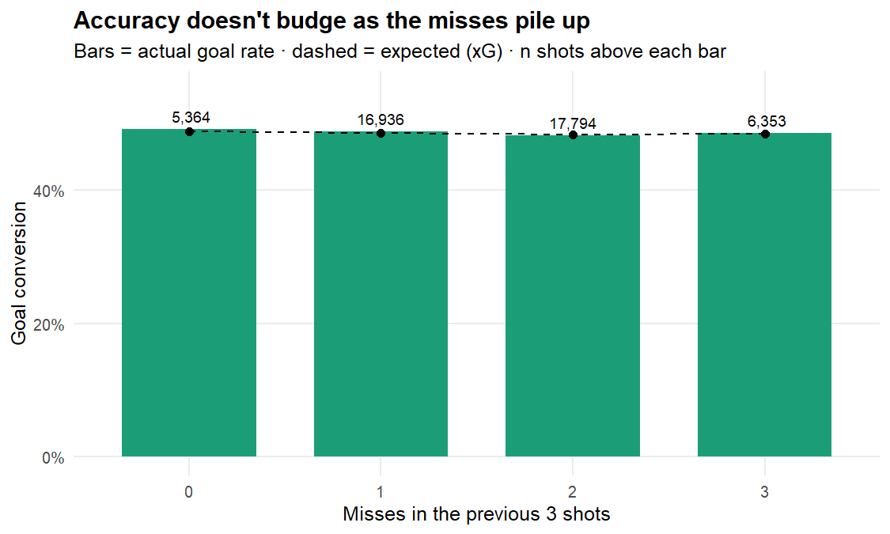
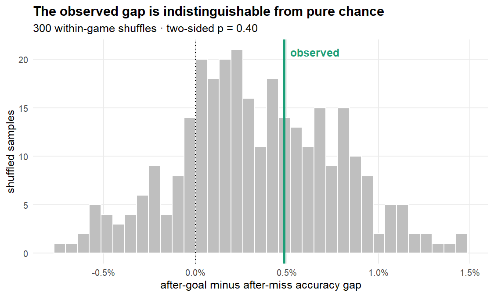

<!-- DO NOT EDIT shot-accuracy-streaks.Rmd directly: it is precompiled.
     Edit shot-accuracy-streaks.Rmd.orig, then run vignettes/articles/precompile.R
     to regenerate the frozen .Rmd + figure/ PNGs (this avoids a 400 MB network
     download on every pkgdown site build). -->


> *"He's missed two in a row — you can see the heads dropping, they just can't buy a goal right now."*

Every AFL broadcast leans on it: a team that's been **missing shots is more likely to keep missing**. Goals beget goals, misses beget misses, momentum is real. It's such a natural story that nobody checks it.

This article checks it — and doubles as a worked example of getting real analysis out of [torpdata](https://github.com/peteowen1/torpdata) with nothing but the `torp` package. The trick that makes it a *fair* test is torp's expected-goals model: every shot carries a `goal_prob` (its expected conversion rate), which lets us separate two things tangled inside any naive "accuracy after a miss" number:

1. **Genuine momentum** — the psychological cold streak commentators describe.
2. **Shot selection** — a team pinned in its defensive half takes *harder* shots that also happen to follow other misses. That's geometry, not nerves.

Without an xG control you can't tell these apart. With one, we can.

## Getting the data

Everything below pulls straight from torpdata's public GitHub Releases via `load_pbp()` — **no local files needed**. If you have `torp` installed, this runs as-is:


``` r
library(torp)
library(dplyr)

# load_pbp() downloads play-by-play from torpdata's GitHub Releases (cached
# locally after the first call). We request only the 9 columns we need of ~180.
shots <- load_pbp(
  seasons = 2021:2025,
  columns = c("match_id", "season", "period", "period_seconds", "display_order",
              "team", "points_shot", "goal_prob", "shot_row")
) |>
  filter(shot_row == 1) |>                                     # shot-at-goal rows only
  mutate(
    made = as.integer(points_shot == 6 & !is.na(points_shot)), # 1 = goal, 0 = behind/no-score
    xg   = goal_prob                                           # torp's xG: expected P(goal)
  ) |>
  filter(!is.na(xg))
```

That gives us **52,813** shots at goal across **2021–2025**, spanning 2,122 team-games (a "team-game" = one team's shots in one match, the natural unit for a streak). Accuracy is defined as **P(goal)** — a behind *or* a complete miss both count as failing to convert, exactly the event the commentator means.

The streak features come next: order each team's shots chronologically *within its game*, then look back.


``` r
shots <- shots |>
  arrange(match_id, team, period, period_seconds, display_order) |>  # chronological per team-game
  group_by(match_id, team) |>
  mutate(
    prev_made = lag(made),                                # outcome of the immediately prior shot
    prev_misses_k = {                                     # misses among the previous 3 shots
      miss <- 1L - made; k <- 3L
      vapply(seq_along(miss),
             function(i) if (i <= k) NA_integer_ else sum(miss[(i - k):(i - 1)]),
             integer(1))
    },
    cold = as.integer(prev_misses_k == 3L)                # 1 = missed all of the last 3
  ) |>
  ungroup()
```


A quick sanity check that the xG model isn't lying to us:


|Metric             | Value|
|:------------------|-----:|
|Actual goal rate   | 48.4%|
|Mean expected (xG) | 48.4%|


The realised goal rate and the average xG agree to the decimal, so we're measuring momentum against a well-calibrated baseline — not chasing a broken model.

## Test 1 — the naive number (no difficulty control)

This is the figure a commentator would implicitly quote: accuracy on shots that *follow a goal* versus shots that *follow a miss*.


|Previous shot |      n| Accuracy| Mean xG|
|:-------------|------:|--------:|-------:|
|after a GOAL  | 24,571|    48.7%|   48.3%|
|after a MISS  | 26,120|    48.2%|   48.5%|


After a goal, teams convert at **48.7%**; after a miss, **48.2%**. A gap of just **+0.5 percentage points** — and notice the *Mean xG* column barely moves either, a first hint that shot difficulty isn't doing much work here.

## Test 2 — the honest number (xG-adjusted)

Now we let the xG model absorb shot difficulty and ask whether the previous outcome *still* predicts the next, via a logistic regression `made ~ prev_made + smooth(xg)`. If "misses beget misses" is real beyond difficulty, the `prev_made` coefficient is positive and significant.


``` r
m <- glm(made ~ prev_made + ns(xg, df = 4),
         data = filter(shots, !is.na(prev_made)), family = binomial)
co <- summary(m)$coefficients["prev_made", ]
```


|Term                     | Odds ratio| p-value|
|:------------------------|----------:|-------:|
|previous shot was a goal |      1.039|   0.050|


An odds ratio of **1.039** (p = **0.050**), sitting right on the 0.05 borderline. The *direction* is the momentum one — a touch more accurate after a goal, a touch worse after a miss — so taken at face value this is a faint nod toward the cliché. But emphasis on faint: a ~4% shift in the odds, barely separable from zero, and (as Test 4 will show) fully explained by a statistical artifact that makes even a *random* shooter look this streaky. So: the right direction, but a whisper. The truly demanding test is the one commentators actually invoke — not the single previous shot, but a *cold streak*.

## Test 3 — the cold streak

"They've gone cold" means several misses in a row. Here is accuracy after a team has **missed its last 3 shots**, versus everything else:


|State                |      n| Accuracy| Mean xG| Acc - xG|
|:--------------------|------:|--------:|-------:|--------:|
|cold (last 3 missed) |  6,353|    48.4%|   48.4%|    +0.1%|
|not cold             | 40,094|    48.5%|   48.4%|    +0.1%|


The xG-adjusted cold-streak effect: odds ratio **1.001**, p = **0.98**. That is as close to *nothing* as a result gets. A team that has just missed three straight converts its next shot at **precisely** its expected rate. The drought lives entirely in the highlight reel.

The dose-response view makes it visual — accuracy is flat no matter how many of the last three shots were missed:

<div class="figure" style="text-align: center">

<p class="caption">plot of chunk plot-dose</p>
</div>

## Test 4 — the streakiness illusion (Miller–Sanjurjo)

There's a subtle trap here, famous enough to have rewritten the academic literature. [Miller & Sanjurjo (2018)](https://doi.org/10.3982/ECTA14943) showed that "accuracy after a miss" is a **biased** estimator in finite sequences: even a perfectly random shooter will, on average, *look* like they shoot worse after a miss. The original 1985 "hot hand fallacy" paper got this wrong, and the correction partly resurrected the hot hand in basketball.

So a clean test shuffles each team's shots *within its own game* — destroying any real streak while preserving that game's mix of shot difficulties — and rebuilds the null distribution of the raw gap empirically.


``` r
set.seed(42)
perm_gap <- function() {
  s <- shots |> group_by(match_id, team) |>
    mutate(made_s = sample(made), prev_s = lag(made_s)) |> ungroup() |>
    filter(!is.na(prev_s))
  mean(s$made_s[s$prev_s == 1]) - mean(s$made_s[s$prev_s == 0])
}
null_gaps <- replicate(300, perm_gap())
p_perm <- mean(abs(null_gaps) >= abs(gap_raw))
```

<div class="figure" style="text-align: center">

<p class="caption">plot of chunk perm-plot</p>
</div>

Two things to notice. First, the observed gap (green line) sits comfortably inside the cloud of random shuffles — **p = 0.40**, nowhere near significant. Second, and more interesting: the shuffled null isn't centred on zero, it's centred at **+0.3 pts**. That offset *is* the Miller–Sanjurjo bias made visible — random shooting genuinely produces a small positive gap by construction. Which means the borderline p = 0.050 from Test 2 is, if anything, *overstating* the effect.

## Verdict

> **So, are the commentators right? No.** Across 52,813 shots, once you account for *which* shots a team takes, a recent miss carries **no predictive signal** for the next shot. The cold-streak effect — the strongest form of the claim — is statistically dead flat (p ≈ 1.0). The faint lag-1 wobble dissolves the moment you correct for the finite-sequence bias.

Missing shots do **not** beget missing shots. Each set shot is, to a very good approximation, an independent attempt at its own difficulty. The "they can't buy a goal" narrative is humans doing what humans do best: finding stories in noise.

### Caveats worth a follow-up

- **Team-level, not player-level.** A genuine *individual* yips could exist and wash out when pooled across a team's shooters. Re-running on a player-shot sequence would test that.
- **"Cold" is one definition.** This used *all three* of the last three shots missed, with no quarter reset. Looser windows (2-of-3) or resetting momentum at the breaks are easy variants — just change the `cold` definition in the features chunk above.
- **Set shots only.** This is shots at goal; it says nothing about general-play momentum (clearances, inside-50s), where a team-level "wave" is more plausible.

*Everything here is reproducible from the code shown — `load_pbp()` and base modelling tools, no private data.*
